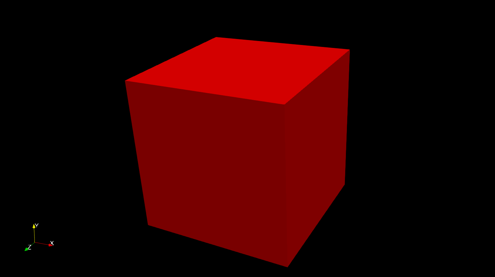
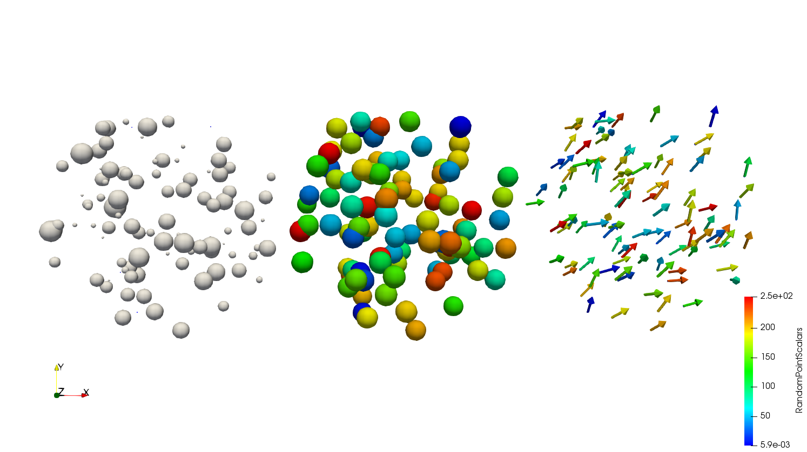
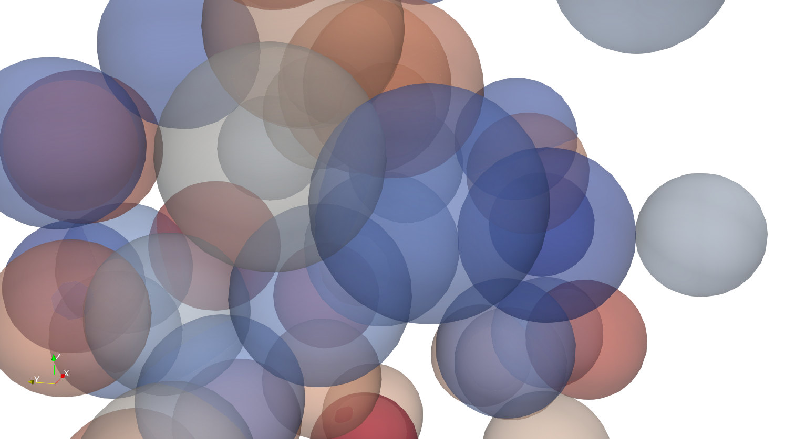
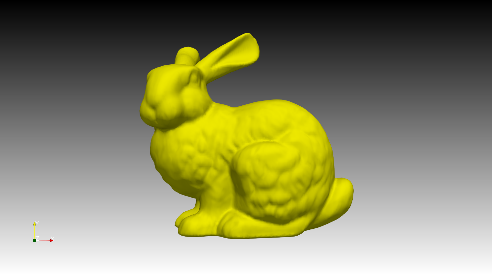
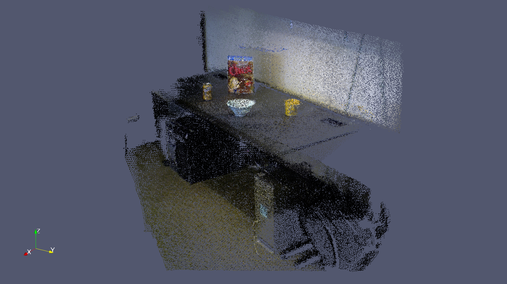
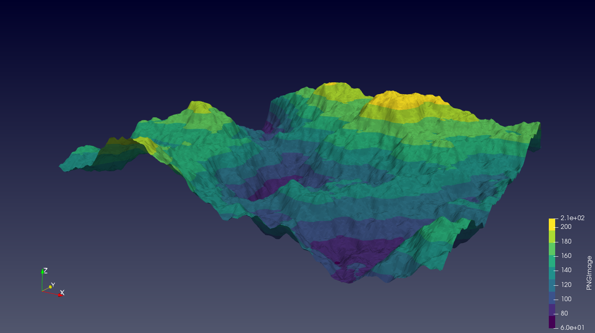
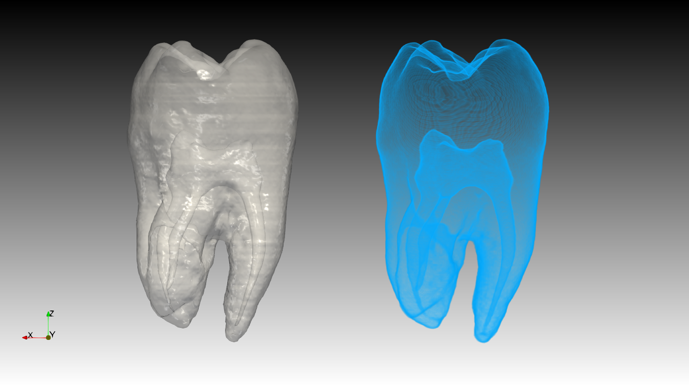
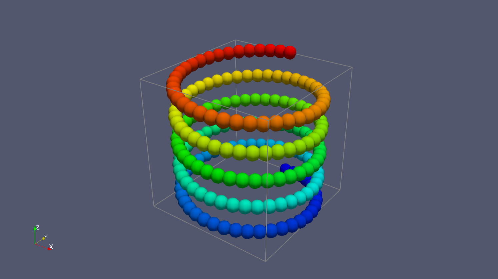

# Assignment 0: ParaView installation 

Note: You do not have to present or hand in anything for this assignment. The goal is to get you started with the visualisation software ParaView that we will use during the course. At the first lab session, you can get help installing ParaView on your own computer. Make sure that you can run the examples below without any graphical incompabilites or other errors before you continue with the other assignments!
 

## Installing ParaView

To install ParaView, the easiest way is to download a binary version of the software from [here](https://www.paraview.org/download/). Binaries are available for Windows, Linux, and MacOS. For this course, you should use the latest stable version (ParaView 5.9.1 as of 2021-08-24).

If you download the software as a zip-file or tar-ball, just extract the archive somewhere and run paraview from the bin-folder. If you use an installer or disk image, just click on the file and follow the instructions.

Once you have finished installing ParaView, try the visualisation examples below to verify that the software is working correctly on your computer. You might find some of the examples useful for solving the tasks in the other assignments :)
 

## Examples

To run the following examples, first download (or clone) the Git-repository of this assignment. Each example is stored as a *.pvsm file (a ParaView state file) that you can open from ParaView by going to File->Load State and selecting the file. For some of the examples, you have to select Search files under specified directory under the dialog Load State Options to load the data files from the correct path.

When you want to load a new example (a new ParaView state file), remember to first clear the current pipeline (Edit->Reset Session) of the active ParaView session.

### 01 - Cube

### 02 - Glyphs

### 03 - Transparency

### 04 - 3D model

### 05 - Point cloud

Note: If the point cloud appears white, you may have to go to Properties for Glyph1 and select RGBA mode under Coloring.

### 06 - Height map

### 07 - Volume rendering (CT data)

### 08 - Animation

To start the animation, press the Play button in the toolbar.
